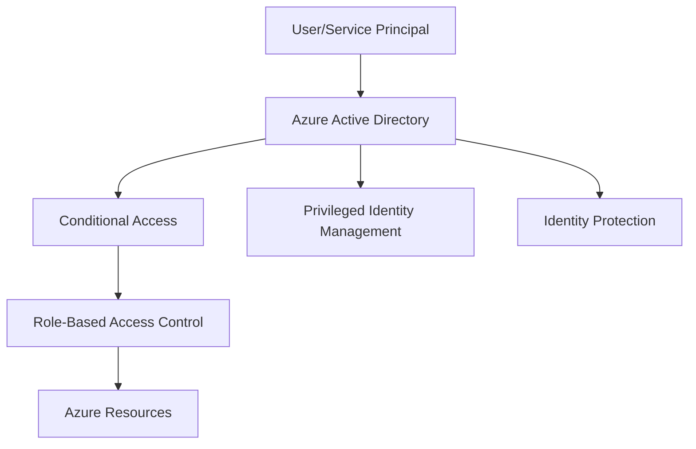

# Azure Identity and Access Management (IAM): Complete Enterprise Guide

## Introduction

Azure Identity and Access Management (IAM) is the cornerstone of cloud security, controlling **who** can access **what** resources and **when**. Understanding Azure IAM is crucial for building secure, compliant, and efficiently managed cloud environments.

## Azure IAM Architecture Overview

### Core Components

Azure IAM consists of several interconnected services:

1. **Azure Active Directory (Azure AD)** - Identity provider and directory service
2. **Role-Based Access Control (RBAC)** - Permission management system
3. **Conditional Access** - Policy-driven access controls
4. **Privileged Identity Management (PIM)** - Just-in-time privileged access
5. **Identity Protection** - Risk-based authentication



## Azure Active Directory Deep Dive

### Identity Types

#### 1. User Identities
- **Cloud-only users**: Created directly in Azure AD
- **Synchronized users**: Synced from on-premises AD via Azure AD Connect
- **Federated users**: Authenticated via external identity providers

#### 2. Service Principals
- **Application registrations**: For custom applications
- **Managed identities**: Azure-managed service accounts
  - System-assigned: Tied to specific Azure resources
  - User-assigned: Standalone identities for multiple resources

#### 3. Groups and Administrative Units
- **Security groups**: For access control
- **Microsoft 365 groups**: For collaboration
- **Administrative units**: For delegated administration

### Best Practices for Azure AD

```powershell
# Create a security group for Azure administrators
New-AzureADGroup -DisplayName "Azure-Administrators" `
                 -MailEnabled $false `
                 -SecurityEnabled $true `
                 -MailNickname "azure-admins"

# Assign users to the group
Add-AzureADGroupMember -ObjectId $groupId -RefObjectId $userId
```

## Role-Based Access Control (RBAC) Mastery

### RBAC Components

1. **Security Principal**: Who gets access (user, group, service principal)
2. **Role Definition**: What actions are allowed
3. **Scope**: Where the permissions apply (subscription, resource group, resource)

### Built-in Roles Hierarchy

```
Owner
├── Contributor
│   ├── Virtual Machine Contributor
│   ├── Storage Account Contributor
│   └── Network Contributor
├── Reader
└── User Access Administrator
```

### Custom Role Creation

```json
{
  "Name": "Virtual Machine Operator",
  "Id": null,
  "IsCustom": true,
  "Description": "Can monitor and restart virtual machines",
  "Actions": [
    "Microsoft.Compute/virtualMachines/start/action",
    "Microsoft.Compute/virtualMachines/restart/action",
    "Microsoft.Compute/virtualMachines/read",
    "Microsoft.Resources/subscriptions/resourceGroups/read"
  ],
  "NotActions": [
    "Microsoft.Compute/virtualMachines/delete"
  ],
  "DataActions": [],
  "NotDataActions": [],
  "AssignableScopes": [
    "/subscriptions/{subscription-id}"
  ]
}
```

### RBAC Assignment Strategy

#### Principle of Least Privilege
```powershell
# Assign minimal required permissions
New-AzRoleAssignment -SignInName "user@domain.com" `
                     -RoleDefinitionName "Virtual Machine Contributor" `
                     -ResourceGroupName "production-vms"
```

#### Just-in-Time Access with PIM
```powershell
# Enable PIM for privileged roles
$settings = @{
    MaximumActivationDuration = "PT8H"
    RequireApproval = $true
    RequireJustification = $true
    RequireMFA = $true
}
```

## Conditional Access Policies

### Policy Components

1. **Assignments**: Who the policy applies to
2. **Cloud apps**: Which applications are included
3. **Conditions**: When the policy applies
4. **Access controls**: What happens when conditions are met

### Common Policy Scenarios

#### 1. Require MFA for Admin Roles
```json
{
  "displayName": "Require MFA for Global Administrators",
  "state": "enabled",
  "conditions": {
    "users": {
      "includeRoles": ["62e90394-69f5-4237-9190-012177145e10"]
    },
    "applications": {
      "includeApplications": ["All"]
    }
  },
  "grantControls": {
    "builtInControls": ["mfa"],
    "operator": "OR"
  }
}
```

#### 2. Block Access from Untrusted Locations
```json
{
  "displayName": "Block access from high-risk locations",
  "conditions": {
    "locations": {
      "includeLocations": ["All"],
      "excludeLocations": ["AllTrusted"]
    },
    "signInRiskLevels": ["high"]
  },
  "grantControls": {
    "builtInControls": ["block"]
  }
}
```

## Advanced IAM Patterns

### 1. Zero Trust Implementation

#### Identity Verification
```csharp
// Implement continuous authentication
public class ZeroTrustAuthHandler : AuthenticationHandler<AuthenticationSchemeOptions>
{
    protected override async Task<AuthenticateResult> HandleAuthenticateAsync()
    {
        // Verify user identity
        var identity = await VerifyUserIdentity();
        
        // Check device compliance
        var deviceCompliant = await CheckDeviceCompliance();
        
        // Evaluate risk signals
        var riskLevel = await EvaluateRiskSignals();
        
        return riskLevel.IsAcceptable && deviceCompliant
            ? AuthenticateResult.Success(identity)
            : AuthenticateResult.Fail("Access denied");
    }
}
```

### 2. Cross-Tenant Access Management

#### B2B Collaboration Setup
```powershell
# Configure external user access
Set-AzureADPolicy -Type B2BManagementPolicy -Definition @{
    InvitationsAllowedAndBlockedDomainsPolicy = @{
        AllowedDomains = @("partner1.com", "partner2.com")
        BlockedDomains = @("competitor.com")
    }
}
```

### 3. Application Integration Patterns

#### Service Principal Authentication
```csharp
public class AzureServiceAuthentication
{
    public async Task<string> GetAccessTokenAsync()
    {
        var credential = new ClientSecretCredential(
            tenantId: "your-tenant-id",
            clientId: "your-client-id",
            clientSecret: "your-client-secret"
        );
        
        var tokenResponse = await credential.GetTokenAsync(
            new TokenRequestContext(new[] { "https://management.azure.com/.default" })
        );
        
        return tokenResponse.Token;
    }
}
```

## Security Best Practices

### 1. Regular Access Reviews

```powershell
# PowerShell script for access review automation
$accessReviews = Get-AzureADMSAccessReview -All
foreach ($review in $accessReviews) {
    $decisions = Get-AzureADMSAccessReviewDecision -AccessReviewId $review.Id
    
    # Process decisions and generate reports
    $decisions | Where-Object { $_.Decision -eq "Deny" } | 
    ForEach-Object {
        # Remove access for denied users
        Write-Host "Removing access for user: $($_.ReviewedBy)"
    }
}
```

### 2. Monitoring and Alerting

#### Log Analytics KQL Queries
```kql
// Monitor privileged role activations
AuditLogs
| where OperationName contains "Add member to role"
| where TargetResources[0].displayName in ("Global Administrator", "User Administrator")
| project TimeGenerated, OperationName, InitiatedBy.user.userPrincipalName, TargetResources[0].displayName
| order by TimeGenerated desc
```

```kql
// Detect suspicious sign-in patterns
SigninLogs
| where RiskLevelDuringSignIn == "high"
| summarize FailedAttempts = countif(ResultType != 0), 
           SuccessfulAttempts = countif(ResultType == 0) 
           by UserPrincipalName, bin(TimeGenerated, 1h)
| where FailedAttempts > 5
```

### 3. Emergency Access Procedures

```json
{
  "emergencyAccessAccount": {
    "username": "breakglass01@domain.com",
    "conditions": {
      "excludeFromCA": true,
      "cloudOnly": true,
      "strongPassword": true,
      "monitoringEnabled": true
    }
  }
}
```

## Compliance and Governance

### 1. GDPR Compliance

```powershell
# Script to handle data subject requests
function Remove-UserData {
    param($userPrincipalName)
    
    # Remove from all groups
    $user = Get-AzureADUser -Filter "userPrincipalName eq '$userPrincipalName'"
    $groups = Get-AzureADUserMembership -ObjectId $user.ObjectId
    
    foreach ($group in $groups) {
        Remove-AzureADGroupMember -ObjectId $group.ObjectId -MemberId $user.ObjectId
    }
    
    # Revoke all sessions
    Revoke-AzureADUserAllRefreshToken -ObjectId $user.ObjectId
}
```

### 2. SOX Compliance

```csharp
// Audit trail implementation
public class AuditLogger
{
    public async Task LogAccessAsync(string userId, string resource, string action)
    {
        var auditEntry = new
        {
            Timestamp = DateTime.UtcNow,
            UserId = userId,
            Resource = resource,
            Action = action,
            IPAddress = GetClientIPAddress(),
            UserAgent = GetUserAgent()
        };
        
        await _auditRepository.SaveAsync(auditEntry);
    }
}
```

## Troubleshooting Common Issues

### 1. Permission Inheritance Problems

```bash
# Check effective permissions
az role assignment list --assignee user@domain.com --include-inherited
```

### 2. Conditional Access Policy Conflicts

```powershell
# Analyze policy conflicts
$policies = Get-AzureADMSConditionalAccessPolicy
foreach ($policy in $policies) {
    Write-Host "Policy: $($policy.DisplayName)"
    Write-Host "State: $($policy.State)"
    Write-Host "Conditions: $($policy.Conditions | ConvertTo-Json -Depth 3)"
}
```

### 3. Service Principal Permission Issues

```csharp
// Debug service principal permissions
public async Task<bool> CheckServicePrincipalPermissions(string servicePrincipalId, string resourceId)
{
    var roleAssignments = await _armClient.GetRoleAssignments()
        .Where(ra => ra.PrincipalId == servicePrincipalId && ra.Scope.Contains(resourceId))
        .ToListAsync();
    
    return roleAssignments.Any();
}
```

## Performance Optimization

### 1. Group-Based Access Management

```powershell
# Optimize with nested groups
$parentGroup = New-AzureADGroup -DisplayName "All-Developers" -SecurityEnabled $true
$teamGroups = @("Frontend-Developers", "Backend-Developers", "DevOps-Engineers")

foreach ($team in $teamGroups) {
    $teamGroup = Get-AzureADGroup -Filter "displayName eq '$team'"
    Add-AzureADGroupMember -ObjectId $parentGroup.ObjectId -RefObjectId $teamGroup.ObjectId
}
```

### 2. Batch Operations

```csharp
// Bulk role assignment
public async Task AssignRolesBulkAsync(List<RoleAssignment> assignments)
{
    var tasks = assignments.Select(async assignment =>
    {
        await _roleAssignmentClient.CreateAsync(
            assignment.Scope,
            assignment.RoleDefinitionId,
            assignment.PrincipalId
        );
    });
    
    await Task.WhenAll(tasks);
}
```

## Future-Proofing Your IAM Strategy

### 1. Prepare for Passwordless Authentication

```json
{
  "authenticationMethods": {
    "fido2": { "enabled": true },
    "microsoftAuthenticator": { "enabled": true },
    "windowsHelloForBusiness": { "enabled": true }
  }
}
```

### 2. Implement Continuous Access Evaluation

```csharp
public class ContinuousAccessEvaluator
{
    public async Task<bool> EvaluateAccessAsync(ClaimsPrincipal user)
    {
        // Check real-time risk signals
        var riskLevel = await _riskEvaluator.GetCurrentRiskLevelAsync(user.GetUserId());
        
        // Verify device compliance
        var deviceStatus = await _deviceComplianceService.CheckAsync(user.GetDeviceId());
        
        // Evaluate location
        var locationRisk = await _locationService.EvaluateRiskAsync(user.GetIPAddress());
        
        return riskLevel.IsAcceptable && deviceStatus.IsCompliant && !locationRisk.IsSuspicious;
    }
}
```

## Conclusion

Azure IAM is a powerful and complex system that requires careful planning and ongoing management. Key takeaways:

1. **Start with least privilege** - Grant minimal required access
2. **Use groups for scalability** - Avoid individual user assignments
3. **Implement Conditional Access** - Add context-aware security
4. **Monitor continuously** - Set up alerts and regular reviews
5. **Plan for compliance** - Build audit trails from the start
6. **Automate where possible** - Reduce manual errors and overhead

By following these practices and understanding the underlying concepts, you'll build a robust, secure, and scalable identity management system that grows with your organization's needs.

Remember: Azure IAM is not a "set it and forget it" system. Regular reviews, updates, and optimization are essential for maintaining security and efficiency in your cloud environment.
