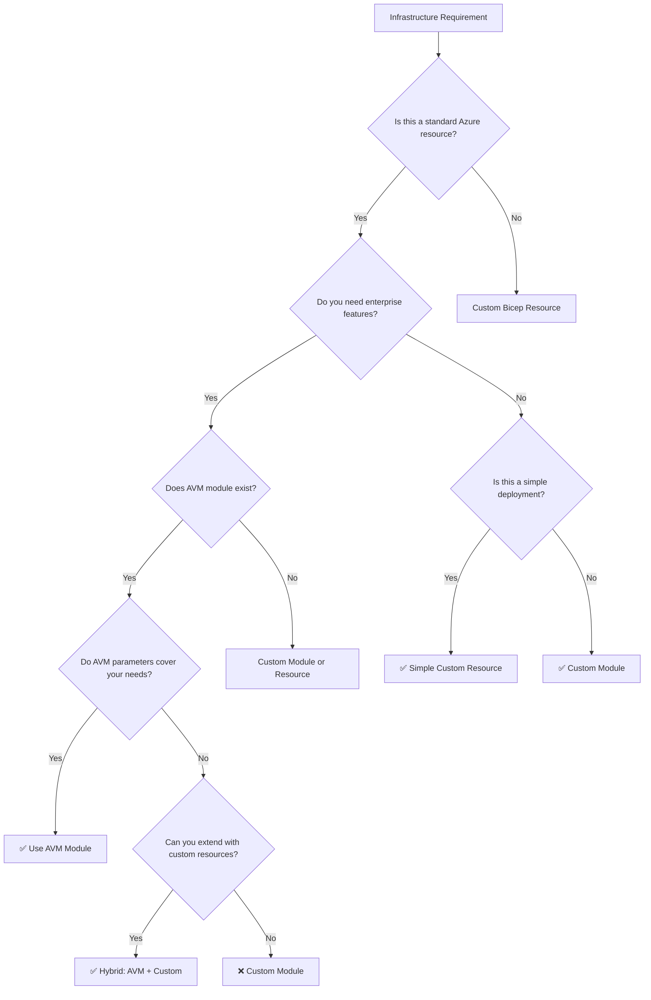

# Azure Bicep AVM Modules: The Ultimate Decision Guide

## Understanding Azure Verified Modules (AVM)

Azure Verified Modules (AVM) represent Microsoft's **official**, **tested**, and **supported** Bicep modules designed to accelerate infrastructure deployment while ensuring best practices. But when should you use them versus creating custom modules?

This comprehensive guide will help you make the right architectural decisions.

## What Are Azure Verified Modules?

### Core Characteristics

```bicep
// Example: AVM storage account module
module storageAccount 'br/public:avm/res/storage/storage-account:0.9.1' = {
  name: 'storageAccountDeployment'
  params: {
    name: 'mystorageaccount001'
    location: location
    skuName: 'Standard_LRS'
    kind: 'StorageV2'
    // 50+ other configurable parameters available
  }
}
```

**Key Benefits:**
- ✅ **Microsoft-supported** and regularly updated
- ✅ **Extensively tested** across scenarios
- ✅ **Best practices built-in** (security, naming, tagging)
- ✅ **Comprehensive parameter coverage**
- ✅ **Consistent patterns** across all modules

## When to Use AVM Modules

### ✅ Perfect Use Cases

#### 1. Standard Infrastructure Components

```bicep
// ✅ PERFECT: Standard web application infrastructure
module vnet 'br/public:avm/res/network/virtual-network:0.1.8' = {
  name: 'vnetDeployment'
  params: {
    name: 'vnet-prod-001'
    location: location
    addressPrefixes: ['10.0.0.0/16']
    subnets: [
      {
        name: 'subnet-web'
        addressPrefix: '10.0.1.0/24'
        networkSecurityGroupResourceId: nsg.outputs.resourceId
      }
      {
        name: 'subnet-data'
        addressPrefix: '10.0.2.0/24'
        privateEndpointNetworkPolicies: 'Disabled'
      }
    ]
  }
}

module appService 'br/public:avm/res/web/site:0.3.9' = {
  name: 'appServiceDeployment'
  params: {
    name: 'app-prod-001'
    location: location
    kind: 'app'
    serverFarmResourceId: appServicePlan.outputs.resourceId
    siteConfig: {
      netFrameworkVersion: 'v6.0'
      alwaysOn: true
      minTlsVersion: '1.2'
    }
  }
}
```

**Why AVM is perfect here:**
- Standard patterns with proven security configurations
- Comprehensive parameter coverage for common scenarios
- Built-in best practices (TLS versions, always-on, etc.)
- Microsoft support for troubleshooting

#### 2. Compliance-Heavy Environments

```bicep
// ✅ PERFECT: SOX-compliant SQL deployment
module sqlServer 'br/public:avm/res/sql/server:0.4.2' = {
  name: 'sqlServerDeployment'
  params: {
    name: 'sql-prod-001'
    location: location
    administratorLogin: administratorLogin
    administratorLoginPassword: administratorPassword
    
    // AVM ensures compliance defaults
    minimalTlsVersion: '1.2'
    publicNetworkAccess: 'Disabled'
    
    // Audit settings included
    auditingSettings: {
      state: 'Enabled'
      storageAccountResourceId: auditStorage.outputs.resourceId
      retentionDays: 90
    }
    
    // Advanced threat protection
    vulnerabilityAssessments: {
      name: 'default'
      emailSubscriptionAdmins: true
      recurringScansEmails: ['security@company.com']
    }
  }
}
```

#### 3. Multi-Environment Deployments

```bicep
// ✅ PERFECT: Consistent deployments across environments
module keyVault 'br/public:avm/res/key-vault/vault:0.6.2' = {
  name: 'keyVaultDeployment'
  params: {
    name: 'kv-${environment}-001'
    location: location
    
    // Environment-specific configurations handled cleanly
    skuName: environment == 'prod' ? 'premium' : 'standard'
    enableSoftDelete: true
    softDeleteRetentionInDays: environment == 'prod' ? 90 : 7
    
    // Role assignments using AVM patterns
    roleAssignments: [
      {
        roleDefinitionIdOrName: 'Key Vault Secrets User'
        principalId: appServiceIdentity.outputs.principalId
        principalType: 'ServicePrincipal'
      }
    ]
  }
}
```

### ✅ Enterprise Scenarios

#### 1. Landing Zone Implementations

```bicep
// ✅ PERFECT: Azure Landing Zone components
module managementGroup 'br/public:avm/res/management/management-group:0.2.3' = {
  name: 'mgmtGroupDeployment'
  params: {
    name: 'corp-landing-zone'
    displayName: 'Corporate Landing Zone'
    parentId: '/providers/Microsoft.Management/managementGroups/root'
  }
}

module policyDefinition 'br/public:avm/res/authorization/policy-definition:0.2.1' = {
  name: 'policyDeployment'
  params: {
    name: 'require-resource-tags'
    displayName: 'Require specific resource tags'
    description: 'Enforces required tags on all resources'
    policyRule: loadJsonContent('policies/require-tags.json')
    managementGroupId: managementGroup.outputs.resourceId
  }
}
```

#### 2. Hub-and-Spoke Network Architecture

```bicep
// ✅ PERFECT: Standard hub-and-spoke using AVM
module hubVNet 'br/public:avm/res/network/virtual-network:0.1.8' = {
  name: 'hubVNetDeployment'
  params: {
    name: 'vnet-hub-001'
    location: location
    addressPrefixes: ['10.0.0.0/16']
    subnets: [
      {
        name: 'GatewaySubnet'
        addressPrefix: '10.0.1.0/24'
      }
      {
        name: 'AzureFirewallSubnet'  
        addressPrefix: '10.0.2.0/24'
      }
    ]
  }
}

module vpnGateway 'br/public:avm/res/network/vpn-gateway:0.3.1' = {
  name: 'vpnGatewayDeployment'
  params: {
    name: 'vgw-hub-001'
    location: location
    gatewayType: 'Vpn'
    vpnType: 'RouteBased'
    generation: 'Generation2'
    skuName: 'VpnGw2'
    virtualNetworkGatewayPipResourceId: gatewayPip.outputs.resourceId
    subnetResourceId: '${hubVNet.outputs.resourceId}/subnets/GatewaySubnet'
  }
}
```

## When NOT to Use AVM Modules

### ❌ Avoid in These Scenarios

#### 1. Highly Customized Solutions

```bicep
// ❌ AVOID AVM: Custom application with specific requirements
resource customAppService 'Microsoft.Web/sites@2023-01-01' = {
  name: 'app-custom-microservice'
  location: location
  kind: 'functionapp,linux'
  properties: {
    serverFarmId: appServicePlan.id
    siteConfig: {
      // Highly specific configuration for microservice
      linuxFxVersion: 'DOCKER|myregistry.azurecr.io/microservice:v2.1.0'
      appSettings: [
        {
          name: 'FUNCTIONS_EXTENSION_VERSION'
          value: '~4'
        }
        {
          name: 'DOCKER_CUSTOM_IMAGE_NAME'
          value: 'myregistry.azurecr.io/microservice:v2.1.0'
        }
        {
          name: 'CUSTOM_MICROSERVICE_CONFIG'
          value: customMicroserviceConfig
        }
        // 20+ custom environment variables specific to this app
      ]
      cors: {
        allowedOrigins: specificAllowedOrigins
        supportCredentials: false
      }
      ipSecurityRestrictions: customIpRestrictions
    }
    httpsOnly: true
    clientAffinityEnabled: false
  }
}
```

**Why custom is better:**
- AVM parameters might not cover your specific use case
- Simpler to maintain for one-off configurations
- Direct control over exact resource properties

#### 2. Legacy System Integration

```bicep
// ❌ AVOID AVM: Legacy integration with specific quirks
resource legacyIntegrationVM 'Microsoft.Compute/virtualMachines@2023-03-01' = {
  name: 'vm-legacy-integration'
  location: location
  properties: {
    hardwareProfile: {
      vmSize: 'Standard_D2s_v3' // Specific size for legacy software
    }
    osProfile: {
      computerName: 'LEGACYSYS01' // Must match existing naming
      adminUsername: 'legacyadmin' // Required by legacy system
      adminPassword: legacyPassword
      windowsConfiguration: {
        provisionVMAgent: true
        enableAutomaticUpdates: false // Legacy app incompatible with updates
        timeZone: 'Eastern Standard Time' // Specific timezone requirement
      }
    }
    storageProfile: {
      osDisk: {
        name: 'disk-legacy-os'
        caching: 'ReadWrite'
        createOption: 'FromImage'
        diskSizeGB: 127 // Exact size for legacy app
        managedDisk: {
          storageAccountType: 'Premium_LRS'
        }
      }
      dataDisks: [
        {
          name: 'disk-legacy-data'
          diskSizeGB: 512
          lun: 0
          createOption: 'Empty'
          caching: 'None' // Legacy app requires specific caching
        }
      ]
    }
    networkProfile: {
      networkInterfaces: [
        {
          id: legacyNetworkInterface.id
          properties: {
            primary: true
          }
        }
      ]
    }
  }
}
```

#### 3. Rapid Prototyping and MVP

```bicep
// ❌ AVOID AVM: Simple MVP development environment
resource mvpResourceGroup 'Microsoft.Resources/resourceGroups@2021-04-01' = {
  name: 'rg-mvp-prototype'
  location: location
}

resource mvpStorageAccount 'Microsoft.Storage/storageAccounts@2023-01-01' = {
  name: 'storagemvp${uniqueString(resourceGroup().id)}'
  location: location
  sku: {
    name: 'Standard_LRS' // Simple, no frills
  }
  kind: 'StorageV2'
  properties: {
    allowBlobPublicAccess: true // MVP needs public access for now
    minimumTlsVersion: 'TLS1_0' // Relaxed for testing
  }
}

resource mvpWebApp 'Microsoft.Web/sites@2023-01-01' = {
  name: 'webapp-mvp-${uniqueString(resourceGroup().id)}'
  location: location
  kind: 'app'
  properties: {
    serverFarmId: mvpAppServicePlan.id
    siteConfig: {
      appSettings: [
        {
          name: 'STORAGE_CONNECTION_STRING'
          value: 'DefaultEndpointsProtocol=https;AccountName=${mvpStorageAccount.name};AccountKey=${mvpStorageAccount.listKeys().keys[0].value}'
        }
      ]
    }
  }
}
```

**Why custom is better for MVP:**
- Faster to write and deploy
- No need for enterprise-grade features
- Can iterate quickly without module versioning concerns

## Hybrid Approach: Best of Both Worlds

### Pattern 1: AVM Core + Custom Extensions

```bicep
// Use AVM for the foundation
module coreInfrastructure 'br/public:avm/res/network/virtual-network:0.1.8' = {
  name: 'coreVNetDeployment'
  params: {
    name: 'vnet-hybrid-001'
    location: location
    addressPrefixes: ['10.0.0.0/16']
    subnets: [
      {
        name: 'subnet-apps'
        addressPrefix: '10.0.1.0/24'
      }
      {
        name: 'subnet-data'
        addressPrefix: '10.0.2.0/24'
      }
    ]
  }
}

// Add custom resources that extend AVM functionality
resource customNetworkWatcher 'Microsoft.Network/networkWatchers@2023-04-01' = {
  name: 'nw-custom-monitoring'
  location: location
  properties: {}
}

resource customFlowLogs 'Microsoft.Network/networkWatchers/flowLogs@2023-04-01' = {
  parent: customNetworkWatcher
  name: 'fl-custom-analysis'
  location: location
  properties: {
    targetResourceId: coreInfrastructure.outputs.resourceId
    storageId: logStorage.id
    enabled: true
    format: {
      type: 'JSON'
      version: 2
    }
    flowAnalyticsConfiguration: {
      networkWatcherFlowAnalyticsConfiguration: {
        enabled: true
        workspaceResourceId: logAnalytics.id
        trafficAnalyticsInterval: 10
      }
    }
  }
}
```

### Pattern 2: Custom Wrapper Modules

```bicep
// File: modules/company-storage.bicep
// Company-specific wrapper around AVM storage module

@description('Environment designation')
@allowed(['dev', 'staging', 'prod'])
param environment string

@description('Application name')
param applicationName string

@description('Location for resources')
param location string = resourceGroup().location

// Company naming conventions
var storageAccountName = 'st${applicationName}${environment}${uniqueString(resourceGroup().id)}'

// Company-specific tags
var defaultTags = {
  Environment: environment
  Application: applicationName
  CostCenter: 'IT-Operations'
  ManagedBy: 'Infrastructure-Team'
  BackupRequired: environment == 'prod' ? 'Yes' : 'No'
}

// Use AVM with company defaults
module storageAccount 'br/public:avm/res/storage/storage-account:0.9.1' = {
  name: 'companyStorageDeployment'
  params: {
    name: storageAccountName
    location: location
    tags: defaultTags
    
    // Company security standards
    skuName: environment == 'prod' ? 'Standard_GRS' : 'Standard_LRS'
    kind: 'StorageV2'
    minimumTlsVersion: 'TLS1_2'
    allowBlobPublicAccess: false
    supportsHttpsTrafficOnly: true
    
    // Company compliance requirements
    deleteRetentionPolicy: {
      enabled: true
      days: environment == 'prod' ? 365 : 30
    }
    
    // Company monitoring standards
    diagnosticSettings: [
      {
        name: 'company-storage-diagnostics'
        workspaceResourceId: '/subscriptions/${subscription().subscriptionId}/resourceGroups/rg-monitoring/providers/Microsoft.OperationalInsights/workspaces/law-company-central'
        logCategoriesAndGroups: [
          {
            categoryGroup: 'allLogs'
            enabled: true
          }
        ]
      }
    ]
  }
}

output storageAccountResourceId string = storageAccount.outputs.resourceId
output storageAccountName string = storageAccount.outputs.name
```

### Pattern 3: Environment-Specific Module Selection

```bicep
// File: main.bicep
@description('Environment type')
@allowed(['dev', 'staging', 'prod'])
param environment string

@description('Use AVM modules for production')
param useAVMModules bool = environment == 'prod'

// Conditional module selection
module productionInfrastructure 'modules/production-avm.bicep' = if (useAVMModules) {
  name: 'prodInfraDeployment'
  params: {
    environment: environment
    location: location
  }
}

module developmentInfrastructure 'modules/development-custom.bicep' = if (!useAVMModules) {
  name: 'devInfraDeployment'
  params: {
    environment: environment
    location: location
  }
}
```

## Decision Framework

### Use This Flowchart



### Evaluation Checklist

```yaml
AVM_Suitability_Assessment:
  StandardResource: 
    - "Is this a common Azure resource type?"
    - "Does an AVM module exist for this resource?"
  
  Requirements_Fit:
    - "Do AVM parameters cover 90%+ of your needs?"
    - "Are the AVM defaults acceptable for your use case?"
    - "Can missing functionality be added via custom resources?"
  
  Operational_Fit:
    - "Do you need Microsoft support for this infrastructure?"
    - "Is this a long-term, production deployment?"
    - "Do you have compliance requirements?"
  
  Team_Capability:
    - "Does your team have Bicep expertise for custom modules?"
    - "Can you maintain custom code long-term?"
    - "Is development speed more important than customization?"
```

## Performance and Maintenance Considerations

### AVM Module Performance

```bicep
// AVM modules can be large - consider deployment time
module largeAVMModule 'br/public:avm/res/compute/virtual-machine:0.2.3' = {
  name: 'vmDeployment'
  params: {
    // 100+ parameters available
    // Large template size
    // Longer deployment times
  }
}

// Optimize with targeted parameters only
module optimizedAVMModule 'br/public:avm/res/compute/virtual-machine:0.2.3' = {
  name: 'vmDeployment'
  params: {
    // Only specify required parameters
    name: 'vm-prod-001'
    location: location
    adminUsername: adminUsername
    adminPassword: adminPassword
    osType: 'Windows'
    vmSize: 'Standard_D2s_v3'
    
    // Let AVM handle the rest with defaults
  }
}
```

### Version Management Strategy

```bicep
// Pin to specific versions for production
module productionStorage 'br/public:avm/res/storage/storage-account:0.9.1' = {
  name: 'prodStorageDeployment'
  // Specific version for stability
}

// Use latest for development (carefully)
module devStorage 'br/public:avm/res/storage/storage-account:' = {
  name: 'devStorageDeployment'
  // Latest version for testing new features
}

// Version upgrade strategy
module upgradeTestStorage 'br/public:avm/res/storage/storage-account:0.10.0' = {
  name: 'upgradeTestDeployment'
  // Test new versions in dev first
}
```

## Real-World Examples

### Example 1: Enterprise Landing Zone (Use AVM)

```bicep
// Perfect AVM use case: Standard enterprise patterns
targetScope = 'managementGroup'

module corpManagementGroup 'br/public:avm/res/management/management-group:0.2.3' = {
  name: 'corpMgDeployment'
  params: {
    name: 'corp'
    displayName: 'Corporate'
    parentId: '/providers/Microsoft.Management/managementGroups/root'
  }
}

module landingZonePolicy 'br/public:avm/res/authorization/policy-set-definition:0.4.0' = {
  name: 'lzPolicyDeployment'
  params: {
    name: 'corporate-baseline'
    displayName: 'Corporate Security Baseline'
    managementGroupId: corpManagementGroup.outputs.resourceId
    policyDefinitions: [
      {
        policyDefinitionId: '/providers/Microsoft.Authorization/policyDefinitions/1e30110a-5ceb-460c-a204-c1c3969c6d62'
        parameters: {
          effect: {
            value: 'Audit'
          }
        }
      }
    ]
  }
}
```

### Example 2: Custom Microservice Platform (Avoid AVM)

```bicep
// Custom platform needs specific configuration
resource microserviceAppServicePlan 'Microsoft.Web/serverfarms@2023-01-01' = {
  name: 'asp-microservices-${environment}'
  location: location
  sku: {
    name: 'P1v3' // Specific for microservice performance needs
    tier: 'PremiumV3'
    size: 'P1v3'
    family: 'Pv3'
    capacity: microserviceInstances
  }
  kind: 'linux'
  properties: {
    reserved: true // Linux containers
  }
}

resource microserviceApp 'Microsoft.Web/sites@2023-01-01' = [for service in microservices: {
  name: 'app-${service.name}-${environment}'
  location: location
  kind: 'app,linux,container'
  properties: {
    serverFarmId: microserviceAppServicePlan.id
    siteConfig: {
      linuxFxVersion: 'DOCKER|${service.containerImage}'
      appSettings: [
        {
          name: 'DOCKER_REGISTRY_SERVER_URL'
          value: containerRegistry.properties.loginServer
        }
        {
          name: 'DOCKER_REGISTRY_SERVER_USERNAME'
          value: containerRegistry.name
        }
        {
          name: 'DOCKER_REGISTRY_SERVER_PASSWORD'
          value: containerRegistry.listCredentials().passwords[0].value
        }
        // Service-specific environment variables
        ...service.environmentVariables
      ]
      alwaysOn: true
      httpLoggingEnabled: true
      detailedErrorLoggingEnabled: true
      
      // Custom health check for microservice
      healthCheckPath: '/health'
      
      // Microservice-specific CORS policy
      cors: {
        allowedOrigins: service.allowedOrigins
        supportCredentials: false
      }
    }
    httpsOnly: true
    clientAffinityEnabled: false
  }
}]
```

## Troubleshooting Common Issues

### AVM Module Issues

```bicep
// Issue: AVM module parameter conflicts
module problematicDeployment 'br/public:avm/res/storage/storage-account:0.9.1' = {
  name: 'storageDeployment'
  params: {
    // ❌ This might conflict with AVM's internal logic
    networkAcls: {
      defaultAction: 'Allow'
      bypass: 'AzureServices'
    }
    // ❌ And this might override AVM's security defaults
    allowBlobPublicAccess: true
  }
}

// ✅ Solution: Work with AVM patterns
module correctDeployment 'br/public:avm/res/storage/storage-account:0.9.1' = {
  name: 'storageDeployment'
  params: {
    // ✅ Use AVM's structured approach
    publicNetworkAccess: 'Enabled'
    networkAcls: {
      defaultAction: 'Allow'
      bypass: 'AzureServices'
      virtualNetworkRules: []
      ipRules: []
    }
    // ✅ Be explicit about security choices
    allowBlobPublicAccess: false // Keep security even in development
  }
}
```

### Custom Module Maintenance

```bicep
// Issue: Custom modules without proper versioning
module customInfra './modules/custom-infrastructure.bicep' = {
  // ❌ No version control, hard to maintain
}

// ✅ Solution: Implement versioning strategy
module customInfra 'br:myregistry.azurecr.io/bicep/modules/custom-infrastructure:v1.2.0' = {
  name: 'customInfraDeployment'
  params: {
    version: 'v1.2.0' // Track module versions
    lastUpdated: '2025-07-19'
    maintainer: 'infrastructure-team@company.com'
  }
}
```

## Conclusion: Making the Right Choice

### Quick Decision Guide

**Use AVM When:**
- ✅ Deploying standard Azure resources
- ✅ Need Microsoft support and updates
- ✅ Building enterprise/production infrastructure
- ✅ Want proven security and compliance defaults
- ✅ Have standard requirements that fit AVM parameters

**Use Custom Bicep When:**
- ✅ Highly specific requirements
- ✅ Rapid prototyping and MVP development
- ✅ Legacy system integration
- ✅ Simple deployments with few parameters
- ✅ Need complete control over resource configuration

**Use Hybrid Approach When:**
- ✅ Want AVM benefits with custom extensions
- ✅ Need company-specific defaults
- ✅ Building reusable company modules
- ✅ Want to leverage both AVM stability and custom flexibility

### The Strategic Approach

1. **Start with AVM** for standard scenarios
2. **Identify gaps** in AVM coverage
3. **Extend with custom resources** where needed
4. **Build custom modules** only when necessary
5. **Monitor AVM updates** for new capabilities
6. **Document your decisions** for future reference

Remember: The goal is **efficient, maintainable infrastructure code**. Choose the approach that best serves your long-term infrastructure strategy, not just immediate needs.

Azure Bicep AVM modules are powerful tools, but they're not universal solutions. Use this guide to make informed decisions that will serve your organization for years to come.
