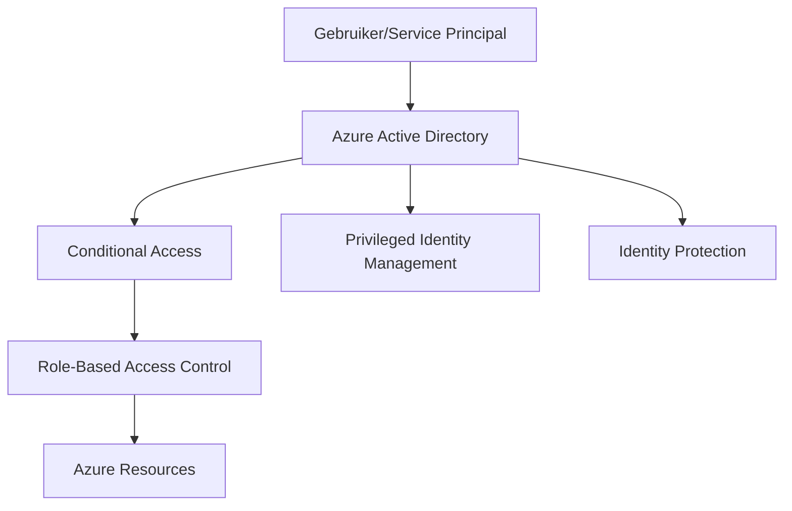

# Azure Identity and Access Management (IAM): Volledige Bedrijfsgids

## Inleiding

Azure Identity and Access Management (IAM) is de hoeksteen van cloudbeveiliging en regelt **wie** toegang heeft tot **welke** resources en **wanneer**. Het begrijpen van Azure IAM is cruciaal voor het bouwen van veilige, compliant en efficiënt beheerde cloudomgevingen.

## Azure IAM Architectuur Overzicht

### Kerncomponenten

Azure IAM bestaat uit verschillende onderling verbonden services:

1. **Azure Active Directory (Azure AD)** - Identity provider en directory service
2. **Role-Based Access Control (RBAC)** - Permissiebeheersysteem
3. **Conditional Access** - Beleidsgestuurde toegangscontroles
4. **Privileged Identity Management (PIM)** - Just-in-time bevoorrechte toegang
5. **Identity Protection** - Risicogebaseerde authenticatie



## Azure Active Directory Diepgaande Analyse

### Identity Types

#### 1. Gebruikersidentiteiten
- **Alleen-cloud gebruikers**: Direct gemaakt in Azure AD
- **Gesynchroniseerde gebruikers**: Gesynchroniseerd vanuit on-premises AD via Azure AD Connect
- **Gefedereerde gebruikers**: Geauthenticeerd via externe identity providers

#### 2. Service Principals
- **Toepassing Service Principals**: Voor applicatie-identiteiten
- **Managed Identities**: Azure-beheerde identiteiten voor resources
  - System-assigned: Gekoppeld aan specifieke resource
  - User-assigned: Onafhankelijke identiteit herbruikbaar over resources

#### 3. Groepen
- **Security Groups**: Voor toegangsbeheer
- **Microsoft 365 Groups**: Voor samenwerking
- **Distribution Lists**: Voor e-mail distributie

### Azure AD Tenants

Een Azure AD tenant is:
- **Dedicated instance** van Azure AD
- **Security boundary** voor identiteiten
- **Administrative boundary** voor beleid en configuratie

```json
{
  "tenantId": "12345678-1234-1234-1234-123456789012",
  "domain": "contoso.com",
  "region": "Europe",
  "subscriptions": ["sub1", "sub2", "sub3"]
}
```

## Role-Based Access Control (RBAC) Mastery

### RBAC Fundamentals

RBAC volgt het principe van **least privilege** door:

1. **Rollen** te definiëren met specifieke permissies
2. **Roltoewijzingen** te maken aan identiteiten
3. **Scopes** te bepalen waar rollen van toepassing zijn

### Built-in Rollen

#### Management Rollen
```yaml
Owner:
  description: "Volledige toegang inclusief het delegeren van toegang"
  permissions: ["*"]
  
Contributor:
  description: "Kan alles beheren behalve toegang verlenen"
  permissions: ["*", "!Microsoft.Authorization/*/Write"]
  
Reader:
  description: "Kan alles bekijken maar geen wijzigingen maken"
  permissions: ["*/read"]
```

#### Service-Specifieke Rollen
```yaml
Storage Blob Data Owner:
  scope: "Storage Account"
  permissions: ["Microsoft.Storage/storageAccounts/blobServices/*"]

Virtual Machine Contributor:
  scope: "Compute Resources"
  permissions: ["Microsoft.Compute/virtualMachines/*"]

SQL DB Contributor:
  scope: "SQL Databases"
  permissions: ["Microsoft.Sql/servers/databases/*"]
```

### Custom Rollen Maken

```json
{
  "Name": "Custom VM Operator",
  "Description": "Kan VMs starten/stoppen maar niet maken/verwijderen",
  "Actions": [
    "Microsoft.Compute/virtualMachines/start/action",
    "Microsoft.Compute/virtualMachines/powerOff/action",
    "Microsoft.Compute/virtualMachines/read"
  ],
  "NotActions": [
    "Microsoft.Compute/virtualMachines/write",
    "Microsoft.Compute/virtualMachines/delete"
  ],
  "AssignableScopes": [
    "/subscriptions/{subscription-id}/resourceGroups/production-vms"
  ]
}
```

### RBAC Best Practices

#### 1. Principle of Least Privilege
```powershell
# ❌ Verkeerd: Te ruime permissies
New-AzRoleAssignment -SignInName "developer@contoso.com" -RoleDefinitionName "Owner" -Scope "/subscriptions/12345"

# ✅ Correct: Minimale benodigde permissies
New-AzRoleAssignment -SignInName "developer@contoso.com" -RoleDefinitionName "Virtual Machine Contributor" -ResourceGroupName "dev-vms"
```

#### 2. Gebruik Groepen voor Roltoewijzingen
```powershell
# ✅ Gebruik groepen in plaats van individuele gebruikers
$group = Get-AzADGroup -DisplayName "DevOps Team"
New-AzRoleAssignment -ObjectId $group.Id -RoleDefinitionName "Contributor" -ResourceGroupName "production"
```

#### 3. Regelmatige Access Reviews
```powershell
# Script voor access review
$roleAssignments = Get-AzRoleAssignment -Scope "/subscriptions/12345"
$roleAssignments | Where-Object {$_.CreatedOn -lt (Get-Date).AddDays(-90)} | Export-Csv "old-assignments.csv"
```

## Conditional Access Geavanceerde Configuratie

### Beleid Componenten

#### 1. Assignments (Toewijzingen)
- **Gebruikers en Groepen**: Wie wordt beïnvloed
- **Cloud Apps**: Welke applicaties
- **Conditions**: Wanneer het beleid wordt toegepast

#### 2. Access Controls (Toegangscontroles)
- **Grant Controls**: Wat moet worden voldaan
- **Session Controls**: Hoe de sessie wordt beheerd

### Praktijk Voorbeelden

#### High-Risk Sign-in Beleid
```json
{
  "displayName": "Block High Risk Sign-ins",
  "state": "enabled",
  "conditions": {
    "signInRiskLevels": ["high"],
    "users": {
      "includeGroups": ["all-users-group-id"]
    }
  },
  "grantControls": {
    "operator": "OR",
    "builtInControls": ["block"]
  }
}
```

#### Multi-Factor Authentication Beleid
```json
{
  "displayName": "Require MFA for Admin Roles",
  "conditions": {
    "users": {
      "includeRoles": [
        "Global Administrator",
        "Security Administrator",
        "Privileged Role Administrator"
      ]
    }
  },
  "grantControls": {
    "operator": "AND",
    "builtInControls": ["mfa"]
  }
}
```

#### Device Compliance Beleid
```json
{
  "displayName": "Require Compliant Device for Office 365",
  "conditions": {
    "applications": {
      "includeApplications": ["Office365"]
    }
  },
  "grantControls": {
    "operator": "OR",
    "builtInControls": ["compliantDevice", "domainJoinedDevice"]
  }
}
```

## Privileged Identity Management (PIM)

### Just-In-Time Access Model

PIM biedt:
- **Time-bound access**: Tijdelijke rol activatie
- **Approval workflow**: Goedkeuringsprocessen
- **Access reviews**: Regelmatige beoordelingen
- **Audit trails**: Volledige logging

### PIM Configuratie Voorbeeld

```powershell
# PIM rol instellen
$roleDefinition = Get-AzRoleDefinition -Name "Global Administrator"
$setting = New-Object Microsoft.Open.MSGraph.Model.UnifiedRoleManagementPolicyRule

$setting.MaximumDuration = "PT8H"  # 8 uur maximum
$setting.RequireApproval = $true
$setting.RequireJustification = $true
$setting.RequireMFA = $true

Set-AzureADMSPrivilegedRoleDefinition -ProviderId "aadRoles" -Id $roleDefinition.Id -RoleSettings $setting
```

## Identity Protection en Risk Management

### Risk Detection Types

#### Real-Time Detecties
- **Anonymous IP address usage**
- **Atypical travel patterns**
- **Malware linked IP addresses**
- **Unfamiliar sign-in properties**

#### Offline Detecties
- **Leaked credentials**
- **Password spray attacks**
- **Impossible travel**

### Risk-Based Policies

```json
{
  "userRiskPolicy": {
    "state": "enabled",
    "conditions": {
      "userRiskLevels": ["medium", "high"]
    },
    "grantControls": {
      "operator": "AND",
      "builtInControls": ["passwordChange"]
    }
  },
  "signInRiskPolicy": {
    "state": "enabled",
    "conditions": {
      "signInRiskLevels": ["medium", "high"]
    },
    "grantControls": {
      "operator": "AND",
      "builtInControls": ["mfa"]
    }
  }
}
```

## Enterprise Security Best Practices

### 1. Zero Trust Architecture

Implementeer Zero Trust principes:

```yaml
Verify Explicitly:
  - Authenticeer en autoriseer gebaseerd op alle beschikbare data points
  
Use Least Permission:
  - Beperk gebruikerstoegang met Just-In-Time en Just-Enough-Access
  
Assume Breach:
  - Minimaliseer blast radius en segmenteer toegang
```

### 2. Identity Governance

```powershell
# Automated Access Review
$accessReview = New-AzureADMSAccessReview -DisplayName "Quarterly Admin Review" `
  -DescriptionForAdmins "Review admin role assignments" `
  -DescriptionForReviewers "Please review if these users still need admin access" `
  -StartDateTime (Get-Date) `
  -EndDateTime (Get-Date).AddDays(30) `
  -ReviewerType "Manager"
```

### 3. Monitoring en Alerting

```kql
// KQL query voor verdachte activiteiten
SigninLogs
| where TimeGenerated > ago(24h)
| where RiskLevelAggregated == "high"
| where ResultType == "0"
| project TimeGenerated, UserPrincipalName, AppDisplayName, IPAddress, Location, RiskDetail
| order by TimeGenerated desc
```

### 4. Emergency Access Accounts

```powershell
# Break-glass account configuratie
$emergencyAccount = New-AzureADUser -DisplayName "Emergency Admin 01" `
  -UserPrincipalName "emergency01@contoso.com" `
  -PasswordProfile @{Password="ComplexPassword123!"; ForceChangePasswordNextLogin=$false} `
  -AccountEnabled $true

# Exclude from all Conditional Access policies
```

## Compliance en Auditing

### Compliance Frameworks

#### SOC 2 Type II
- **Security**: Fysieke en logische toegangscontroles
- **Availability**: Systeembeschikbaarheid en prestaties
- **Confidentiality**: Informatie classificatie en beveiliging

#### ISO 27001
- **Information Security Management System (ISMS)**
- **Risk Assessment en Treatment**
- **Continuous Improvement**

### Audit Logs en Reporting

```powershell
# Azure AD Audit Logs exporteren
$auditLogs = Get-AzureADAuditDirectoryLogs -Filter "activityDateTime ge 2024-01-01" 
$auditLogs | Export-Csv "AzureAD-AuditLogs.csv" -NoTypeInformation

# Sign-in Logs analyseren
$signInLogs = Get-AzureADSignInLogs -Top 1000
$signInLogs | Where-Object {$_.Status.ErrorCode -ne "0"} | 
  Group-Object Status.FailureReason | 
  Sort-Object Count -Descending |
  Format-Table Name, Count
```

## Troubleshooting Gids

### Veelvoorkomende IAM Issues

#### 1. Permission Denied Errors
```powershell
# Diagnose RBAC issues
$user = Get-AzADUser -UserPrincipalName "user@contoso.com"
Get-AzRoleAssignment -ObjectId $user.Id | Format-Table RoleDefinitionName, Scope
```

#### 2. Conditional Access Blocks
```kql
SigninLogs
| where UserPrincipalName == "user@contoso.com"
| where TimeGenerated > ago(1h)
| project TimeGenerated, Status, ConditionalAccessPolicies
```

#### 3. MFA Registration Issues
```powershell
# Check MFA status
Get-MsolUser -UserPrincipalName "user@contoso.com" | Select-Object StrongAuthenticationMethods
```

## Conclusie

Azure IAM is een krachtig maar complex systeem dat zorgvuldige planning en implementatie vereist. Door de principes en best practices in deze gids te volgen, kunt u een robuust beveiligingsframework bouwen dat voldoet aan enterprise vereisten.

### Volgende Stappen

1. **Assessment**: Voer een IAM maturity assessment uit
2. **Planning**: Ontwikkel een gefaseerde implementatieplan
3. **Implementation**: Begin met high-impact, low-risk wijzigingen
4. **Monitoring**: Implementeer continue monitoring en alerting
5. **Optimization**: Regelmatige reviews en optimalisaties

Voor meer geavanceerde Azure IAM strategieën en implementatie ondersteuning, neem contact op met ons team van gecertificeerde Azure security specialisten.
