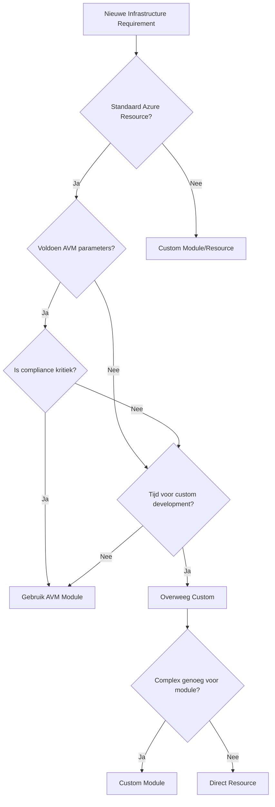

# Azure Bicep AVM Modules: De Ultieme Beslissingsgids

## Azure Verified Modules (AVM) Begrijpen

Azure Verified Modules (AVM) vertegenwoordigen Microsoft's **officiële**, **geteste** en **ondersteunde** Bicep modules ontworpen om infrastructuur deployment te versnellen terwijl best practices worden gegarandeerd. Maar wanneer moet je ze gebruiken versus het maken van custom modules?

Deze uitgebreide gids helpt je de juiste architecturale beslissingen te maken.

## Wat zijn Azure Verified Modules?

### Kernkarakteristieken

```bicep
// Voorbeeld: AVM storage account module
module storageAccount 'br/public:avm/res/storage/storage-account:0.9.1' = {
  name: 'storageAccountDeployment'
  params: {
    name: 'mystorageaccount001'
    location: location
    skuName: 'Standard_LRS'
    kind: 'StorageV2'
    // 50+ andere configureerbare parameters beschikbaar
  }
}
```

**Belangrijkste Voordelen:**
- ✅ **Microsoft-ondersteund** en regelmatig bijgewerkt
- ✅ **Uitgebreid getest** in verschillende scenario's
- ✅ **Best practices ingebouwd** (beveiliging, naamgeving, tagging)
- ✅ **Uitgebreide parameter dekking**
- ✅ **Consistente patronen** over alle modules

## Wanneer AVM Modules Gebruiken

### ✅ Perfecte Use Cases

#### 1. Standaard Infrastructuur Componenten

```bicep
// ✅ PERFECT: Standaard web applicatie infrastructuur
module storageAccount 'br/public:avm/res/storage/storage-account:0.9.1' = {
  name: 'webappStorage'
  params: {
    name: 'webapp${uniqueString(resourceGroup().id)}'
    location: location
    skuName: 'Standard_LRS'
    publicNetworkAccess: 'Disabled'
    networkAcls: {
      defaultAction: 'Deny'
      virtualNetworkRules: [
        {
          id: subnet.id
          action: 'Allow'
        }
      ]
    }
  }
}

module appServicePlan 'br/public:avm/res/web/serverfarm:0.4.1' = {
  name: 'appServicePlan'
  params: {
    name: 'asp-${workloadName}-${environment}'
    location: location
    skuName: 'P1v3'
    zoneRedundant: true
  }
}
```

**Waarom AVM hier perfect is:**
- Standaard Azure resources met voorspelbare configuraties
- Volledige parameter sets beschikbaar
- Ingebouwde security best practices
- Microsoft ondersteuning en updates

#### 2. Compliance-Gevoelige Omgevingen

```bicep
// ✅ AVM modules hebben ingebouwde compliance features
module keyVault 'br/public:avm/res/key-vault/vault:0.6.1' = {
  name: 'complianceKeyVault'
  params: {
    name: 'kv-${workloadName}-${environment}'
    location: location
    enabledForDeployment: false
    enabledForDiskEncryption: true
    enabledForTemplateDeployment: false
    enablePurgeProtection: true // Compliance vereiste
    enableSoftDelete: true      // Compliance vereiste
    softDeleteRetentionInDays: 90
    networkAcls: {
      defaultAction: 'Deny'
      bypass: 'AzureServices'
    }
    diagnosticSettings: [
      {
        workspaceResourceId: logAnalyticsWorkspace.id
        logCategoriesAndGroups: [
          {
            categoryGroup: 'audit'
            enabled: true
          }
        ]
      }
    ]
  }
}
```

#### 3. Grote Enterprise Deployments

```bicep
// ✅ Consistentie over meerdere teams en projecten
module networkHub 'br/public:avm/res/network/virtual-network:0.4.1' = {
  name: 'hubNetwork'
  params: {
    name: 'vnet-hub-${location}'
    location: location
    addressPrefixes: ['10.0.0.0/16']
    subnets: [
      {
        name: 'GatewaySubnet'
        addressPrefix: '10.0.1.0/27'
      }
      {
        name: 'AzureFirewallSubnet'
        addressPrefix: '10.0.2.0/26'
      }
      {
        name: 'shared-services'
        addressPrefix: '10.0.10.0/24'
        networkSecurityGroupResourceId: nsg.id
      }
    ]
    tags: standardTags
  }
}
```

### ✅ Scenario's Waar AVM Uitblinkt

#### Multi-Region Deployments
```bicep
// Consistente configuratie over regio's
param regions array = ['westeurope', 'northeurope']

module storageAccounts 'br/public:avm/res/storage/storage-account:0.9.1' = [for region in regions: {
  name: 'storage-${region}'
  params: {
    name: 'st${workloadName}${region}${environment}'
    location: region
    skuName: 'Standard_GRS'
    kind: 'StorageV2'
    // Identieke configuratie gegarandeerd
  }
}]
```

#### Security by Default
```bicep
// AVM modules hebben security defaults
module sqlServer 'br/public:avm/res/sql/server:0.7.1' = {
  name: 'sqlServer'
  params: {
    name: 'sql-${workloadName}-${environment}'
    location: location
    administratorLogin: 'sqladmin'
    administratorLoginPassword: sqlAdminPassword
    // Deze zijn automatisch ingeschakeld in AVM:
    // - Azure AD Authentication
    // - TDE (Transparent Data Encryption)
    // - Advanced Threat Protection
    // - Vulnerability Assessment
  }
}
```

## Wanneer NIET AVM Modules Gebruiken

### ❌ Vermijd AVM Wanneer

#### 1. Highly Specialized Requirements

```bicep
// ❌ AVM te rigide voor edge cases
// Custom module nodig voor speciale configuratie
resource specializedVm 'Microsoft.Compute/virtualMachines@2023-03-01' = {
  name: 'specialized-vm'
  location: location
  properties: {
    hardwareProfile: {
      vmSize: 'Standard_M128ms' // High-memory specialized instance
    }
    storageProfile: {
      osDisk: {
        createOption: 'FromImage'
        diskSizeGB: 2048
        managedDisk: {
          storageAccountType: 'Premium_LRS'
          diskEncryptionSet: {
            id: customEncryptionSet.id // Speciale encryptie vereisten
          }
        }
      }
      dataDisks: [for i in range(0, 16): { // 16 data disks - ongebruikelijk
        createOption: 'Empty'
        diskSizeGB: 4095
        lun: i
        managedDisk: {
          storageAccountType: 'Premium_LRS'
        }
      }]
    }
    networkProfile: {
      networkInterfaces: [
        {
          id: primaryNic.id
          properties: {
            primary: true
          }
        }
        // Meerdere NICs voor speciale networking
        {
          id: secondaryNic.id
          properties: {
            primary: false
          }
        }
      ]
    }
  }
}
```

#### 2. Legacy System Integration

```bicep
// ❌ Complexe legacy integratie
resource customNetworkSecurityGroup 'Microsoft.Network/networkSecurityGroups@2023-04-01' = {
  name: 'nsg-legacy-integration'
  location: location
  properties: {
    securityRules: [
      // Specifieke regels voor legacy systemen
      {
        name: 'Allow-Legacy-Protocol'
        properties: {
          protocol: 'Tcp'
          sourcePortRange: '*'
          destinationPortRange: '1433'
          sourceAddressPrefix: '192.168.100.0/24' // Legacy subnet
          destinationAddressPrefix: 'VirtualNetwork'
          access: 'Allow'
          priority: 100
          direction: 'Inbound'
        }
      }
      {
        name: 'Allow-Custom-Protocol'
        properties: {
          protocol: 'Tcp'
          sourcePortRange: '*'
          destinationPortRange: '8080-8090' // Custom port range
          sourceAddressPrefix: legacySystemIp
          destinationAddressPrefix: '*'
          access: 'Allow'
          priority: 110
          direction: 'Inbound'
        }
      }
    ]
  }
}
```

#### 3. Rapid Prototyping

```bicep
// ❌ Voor snelle prototypes is AVM te zwaar
// Simpele resources volstaan
resource quickTestStorage 'Microsoft.Storage/storageAccounts@2023-01-01' = {
  name: 'test${uniqueString(resourceGroup().id)}'
  location: location
  sku: {
    name: 'Standard_LRS'
  }
  kind: 'StorageV2'
  properties: {
    publicNetworkAccess: 'Enabled' // Voor snelle toegang tijdens development
  }
}
```

#### 4. Cost-Optimized Solutions

```bicep
// ❌ Minimale configuratie voor kostenoptimalisatie
resource budgetVm 'Microsoft.Compute/virtualMachines@2023-03-01' = {
  name: 'budget-vm'
  location: location
  properties: {
    hardwareProfile: {
      vmSize: 'Standard_B1s' // Kleinste mogelijke size
    }
    storageProfile: {
      osDisk: {
        createOption: 'FromImage'
        diskSizeGB: 30 // Minimale disk size
        managedDisk: {
          storageAccountType: 'Standard_LRS' // Goedkoopste optie
        }
      }
    }
    // Minimale configuratie - geen extra features
  }
}
```

## Hybride Benaderingen

### 🔄 Best of Both Worlds

#### AVM met Custom Extensions

```bicep
// Gebruik AVM als basis en extend met custom logica
module baseStorageAccount 'br/public:avm/res/storage/storage-account:0.9.1' = {
  name: 'baseStorage'
  params: {
    name: storageAccountName
    location: location
    skuName: 'Standard_LRS'
    kind: 'StorageV2'
  }
}

// Custom extensie voor specifieke behoeften
resource customBlobService 'Microsoft.Storage/storageAccounts/blobServices@2023-01-01' = {
  name: 'default'
  parent: resourceId('Microsoft.Storage/storageAccounts', storageAccountName)
  properties: {
    cors: {
      corsRules: [
        {
          allowedOrigins: customCorsOrigins
          allowedMethods: ['GET', 'POST', 'PUT']
          allowedHeaders: ['*']
          exposedHeaders: ['*']
          maxAgeInSeconds: 3600
        }
      ]
    }
    // Custom lifecycle management
    policy: {
      rules: customLifecycleRules
    }
  }
  dependsOn: [
    baseStorageAccount
  ]
}
```

#### Wrapper Modules

```bicep
// Custom wrapper om AVM te combineren
@description('Deploy complete web application stack')
module webAppStack './modules/webapp-stack.bicep' = {
  name: 'webAppStack'
  params: {
    workloadName: workloadName
    environment: environment
    location: location
    customSettings: {
      enableCustomDomain: true
      certificateThumbprint: sslCertThumbprint
      customBackendConfig: customBackendConfiguration
    }
  }
}

// In webapp-stack.bicep - combineer AVM modules
module appServicePlan 'br/public:avm/res/web/serverfarm:0.4.1' = {
  // AVM module voor basis configuratie
}

module webApp 'br/public:avm/res/web/site:0.8.1' = {
  // AVM module voor web app
}

// Custom resources voor specifieke behoeften
resource customDomainBinding 'Microsoft.Web/sites/hostNameBindings@2022-09-01' = {
  // Custom configuratie die niet in AVM zit
}
```

## Performance en Maintenance Overwegingen

### AVM Module Performance

```bicep
// ✅ AVM modules zijn geoptimaliseerd
module optimizedStorage 'br/public:avm/res/storage/storage-account:0.9.1' = {
  name: 'storage-${uniqueString(deployment().name)}'
  params: {
    name: storageAccountName
    location: location
    // AVM gebruikt conditional deployment voor performance
    diagnosticSettings: enableDiagnostics ? diagnosticSettings : []
    privateEndpoints: enablePrivateEndpoints ? privateEndpointConfig : []
    // Geen onnodige resources worden gedeployed
  }
}
```

### Version Management

```bicep
// ✅ Explicit version pinning voor stabiliteit
module prodStorage 'br/public:avm/res/storage/storage-account:0.9.1' = {
  // Gebruik specifieke versie in productie
}

// Voor development kun je latest gebruiken
module devStorage 'br/public:avm/res/storage/storage-account:latest' = {
  // Latest voor nieuwe features tijdens ontwikkeling
}
```

## Decision Framework

### Gebruik deze checklist:

#### ✅ Gebruik AVM wanneer:
- [ ] Standaard Azure resource configuratie
- [ ] Compliance/security is kritiek
- [ ] Team heeft beperkte Bicep expertise
- [ ] Consistentie over projecten gewenst
- [ ] Microsoft support gewenst
- [ ] Standaard parameter set volstaat

#### ❌ Gebruik Custom wanneer:
- [ ] Highly specialized requirements
- [ ] Legacy system integratie
- [ ] Extreme kostenoptimalisatie
- [ ] Rapid prototyping
- [ ] Unieke configuratie patterns
- [ ] AVM parameters zijn onvoldoende

### Decision Tree



## Implementatie Strategie

### Gefaseerde Migratie

#### Fase 1: Assessment
```powershell
# Inventory huidige Bicep modules
Get-ChildItem -Path "./bicep/modules" -Recurse -Filter "*.bicep" | 
  ForEach-Object {
    $content = Get-Content $_.FullName -Raw
    [PSCustomObject]@{
      Module = $_.Name
      ResourceTypes = (Select-String -InputObject $content -Pattern "resource \w+ '([^']+)'" -AllMatches).Matches.Groups[1].Value
      Complexity = ($content.Split("`n")).Count
      HasParameters = $content -like "*param *"
    }
  } | Export-Csv "module-inventory.csv"
```

#### Fase 2: Prioritering
```bicep
// Start met low-risk, high-impact modules
// Bijvoorbeeld: Storage Accounts, Key Vaults, Basic VMs

// Hoge prioriteit voor AVM migratie:
var highPriorityResources = [
  'Microsoft.Storage/storageAccounts'
  'Microsoft.KeyVault/vaults'
  'Microsoft.Network/virtualNetworks'
  'Microsoft.Compute/virtualMachines'
]
```

#### Fase 3: Implementatie
```bicep
// Parallel deployment strategie
module storageAccounts 'br/public:avm/res/storage/storage-account:0.9.1' = [for storage in storageConfigs: {
  name: 'storage-${storage.name}'
  params: storage.params
}]

// Behoud custom modules waar nodig
module customComponents './modules/custom-component.bicep' = {
  name: 'customComponent'
  params: customParams
}
```

## Monitoring en Governance

### AVM Module Governance

```yaml
# Azure Policy voor AVM enforcement
policyRule:
  if:
    allOf:
      - field: "type"
        equals: "Microsoft.Resources/deployments"
      - field: "Microsoft.Resources/deployments/templateLink.uri"
        notLike: "https://raw.githubusercontent.com/Azure/bicep-registry-modules/*"
  then:
    effect: "audit" # of "deny" voor strikte enforcement
```

### Monitoring Template

```kql
// Monitor AVM module deployments
AzureActivity
| where CategoryValue == "Administrative"
| where ResourceProviderValue == "Microsoft.Resources"
| where OperationNameValue == "Microsoft.Resources/deployments/write"
| extend TemplateUri = tostring(Properties.templateLink.uri)
| where TemplateUri contains "bicep-registry-modules"
| project TimeGenerated, Caller, ResourceGroup, TemplateUri, ActivityStatusValue
| order by TimeGenerated desc
```

## Conclusie

De keuze tussen AVM modules en custom Bicep code is niet binair. De beste strategie combineert beide benaderingen:

### 🎯 Aanbevolen Aanpak:

1. **Start met AVM** voor standaard resources
2. **Extend met custom code** waar nodig
3. **Ontwikkel wrappers** voor complexe scenario's
4. **Monitor en optimaliseer** regelmatig

### 📈 Succesfactoren:

- **Team Training**: Investeer in Bicep en AVM kennis
- **Governance**: Implementeer clear guidelines
- **Monitoring**: Track deployment succes en performance
- **Continuous Improvement**: Regelmatige review van module choices

Door deze richtlijnen te volgen, maximaliseer je de voordelen van AVM terwijl je flexibiliteit behoudt voor unieke requirements.

Voor geavanceerde AVM implementatie strategieën en custom module ontwikkeling, neem contact op met onze Infrastructure as Code specialisten.
