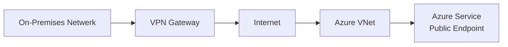
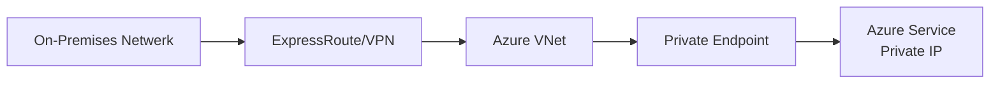

# Private Endpoints vs VPNs: Het Beveiligingsvoordeel Dat Alles Verandert

## De Traditionele Benadering vs De Moderne Oplossing

Jarenlang zijn Virtual Private Networks (VPNs) de go-to oplossing geweest voor veilige verbindingen met cloud resources. Maar Azure Private Endpoints vertegenwoordigen een paradigmaverschuiving die **superieure beveiliging**, **betere prestaties** en **vereenvoudigd beheer** biedt. Laten we onderzoeken waarom Private Endpoints de voorkeurskeuze worden voor enterprise Azure deployments.

## Het Fundamentele Verschil Begrijpen

### VPN Architectuur


### Private Endpoint Architectuur


## Beveiligingsvoordelen van Private Endpoints

### 1. Eliminatie van Internet Blootstelling

**VPN Beperkingen:**
- Verkeer gaat nog steeds via public endpoints
- Services blijven toegankelijk vanaf internet
- Aanvalsoppervlak omvat zowel VPN als service endpoints

**Private Endpoint Voordelen:**
```bicep
// Volledige isolatie van internet verkeer
resource privateEndpoint 'Microsoft.Network/privateEndpoints@2023-04-01' = {
  name: 'pe-storage-account'
  location: location
  properties: {
    subnet: {
      id: privateSubnet.id
    }
    privateLinkServiceConnections: [
      {
        name: 'storage-connection'
        properties: {
          privateLinkServiceId: storageAccount.id
          groupIds: ['blob']
        }
      }
    ]
  }
}

// DNS configuratie voor private resolution
resource privateDnsZone 'Microsoft.Network/privateDnsZones@2020-06-01' = {
  name: 'privatelink.blob.core.windows.net'
  location: 'global'
}
```

**Resultaat:** Service is **volledig geïsoleerd** van internet, toegankelijk alleen via private IP addresses binnen jouw netwerk.

### 2. Zero Trust Network Access

**Traditional VPN Model:**
```yaml
Trust Model: "Trust but Verify"
Network Perimeter: VPN Gateway
Security: Network-level encryption
Access Control: Broad network access once authenticated
```

**Private Endpoint Model:**
```yaml
Trust Model: "Never Trust, Always Verify"
Network Perimeter: Per-service isolation
Security: End-to-end encryption + network isolation
Access Control: Service-specific, granular permissions
```

### 3. Advanced Threat Protection

```bicep
// Private Endpoints integreren met Azure Security Center
resource storageAccount 'Microsoft.Storage/storageAccounts@2023-01-01' = {
  name: 'securestorage001'
  location: location
  properties: {
    // Disable public access completely
    publicNetworkAccess: 'Disabled'
    
    // Enable Advanced Threat Protection
    advancedThreatProtectionSettings: {
      isEnabled: true
    }
    
    // Network isolation
    networkAcls: {
      defaultAction: 'Deny'
      bypass: 'None'
      virtualNetworkRules: []  // Geen VNet regels nodig
      ipRules: []              // Geen IP whitelist nodig
    }
  }
}
```

## Performance Voordelen

### 1. Network Latency Reduction

**VPN Route:**
```
On-Premises → VPN Gateway → Internet → Azure Public Endpoint → Service
Latency: ~50-100ms additional overhead
```

**Private Endpoint Route:**
```
On-Premises → ExpressRoute/VPN → VNet → Private Endpoint → Service
Latency: ~5-15ms reduction in typical scenarios
```

### 2. Bandwidth Optimization

```bicep
// Dedicated bandwidth voor kritieke services
resource expressRouteGateway 'Microsoft.Network/virtualNetworkGateways@2023-04-01' = {
  name: 'ergw-production'
  location: location
  properties: {
    gatewayType: 'ExpressRoute'
    sku: {
      name: 'ErGw3AZ'      // 10 Gbps dedicated bandwidth
      tier: 'ErGw3AZ'
    }
    // High-performance configuration voor Private Endpoints
  }
}
```

### 3. Predictable Performance

```kql
// Monitor Private Endpoint performance
NetworkMonitoring
| where TimeGenerated > ago(24h)
| where DestinationIP startswith "10.0"  // Private IP range
| summarize 
    AvgLatency = avg(LatencyMs),
    MaxLatency = max(LatencyMs),
    PacketLoss = avg(PacketLossPercent)
  by bin(TimeGenerated, 1h), DestinationServiceName
| order by TimeGenerated desc
```

## Management en Operational Voordelen

### 1. Centralized DNS Management

```bicep
// Private DNS Zones voor service discovery
resource privateDnsZones 'Microsoft.Network/privateDnsZones@2020-06-01' = [for service in azureServices: {
  name: 'privatelink.${service.dnsZone}'
  location: 'global'
  
  // Automatic registration van private endpoints
  properties: {
    registrationEnabled: false  // Manual control over records
  }
}]

// Link DNS zones naar VNets
resource dnsZoneLinks 'Microsoft.Network/privateDnsZones/virtualNetworkLinks@2020-06-01' = [for (vnet, i) in virtualNetworks: {
  name: 'link-${vnet.name}'
  parent: privateDnsZones[0]
  location: 'global'
  properties: {
    registrationEnabled: false
    virtualNetwork: {
      id: vnet.id
    }
  }
}]
```

### 2. Simplified Security Posture

**VPN Security Complexity:**
```yaml
Components to Secure:
  - VPN Gateway
  - Public IP addresses  
  - VPN client configurations
  - Certificate management
  - Network routing rules
  - Firewall rules for public endpoints
  - VPN protocol updates
```

**Private Endpoint Simplicity:**
```yaml
Components to Secure:
  - Private Endpoint (managed by Azure)
  - Private DNS resolution
  - Network Security Groups (optional)
  - Azure RBAC permissions
```

### 3. Automated Compliance

```bicep
// Private Endpoints ondersteunen automatische compliance
resource keyVaultPrivateEndpoint 'Microsoft.Network/privateEndpoints@2023-04-01' = {
  name: 'pe-keyvault-compliance'
  location: location
  properties: {
    subnet: {
      id: complianceSubnet.id
    }
    privateLinkServiceConnections: [
      {
        name: 'keyvault-connection'
        properties: {
          privateLinkServiceId: keyVault.id
          groupIds: ['vault']
        }
      }
    ]
  }
  
  // Automatic diagnostic settings
  resource diagnosticSettings 'diagnosticSettings@2021-05-01-preview' = {
    name: 'pe-diagnostics'
    properties: {
      workspaceId: logAnalyticsWorkspace.id
      logs: [
        {
          categoryGroup: 'audit'
          enabled: true
          retentionPolicy: {
            enabled: true
            days: 365  // Compliance requirement
          }
        }
      ]
    }
  }
}
```

## Cost Comparison Analysis

### VPN Total Cost of Ownership

```yaml
Initial Costs:
  VPN Gateway (VpnGw3AZ): €347/maand
  Public IP Addresses: €3.65/maand per IP
  VPN Client Licenses: €15/gebruiker/maand

Operational Costs:
  Data Transfer (Outbound): €0.08/GB
  VPN Gateway Bandwidth: €0.05/GB
  Management Overhead: 20 uur/maand @ €150/uur

Security Costs:
  Additional Firewall Rules: €500/maand
  Certificate Management: €200/maand
  Monitoring Tools: €300/maand
```

### Private Endpoint Cost Structure

```yaml
Direct Costs:
  Private Endpoint: €7.30/maand per endpoint
  Private DNS Zone: €0.50/maand per zone
  
Data Transfer:
  No outbound charges voor private traffic
  ExpressRoute: €155/maand (1 Gbps)
  
Operational Savings:
  Reduced Management: -15 uur/maand
  No Public IP Management: -€100/maand
  Simplified Security: -€400/maand
```

### ROI Calculation

```bicep
// Cost calculator template
param numberOfServices int = 10
param monthlyDataTransfer int = 1000  // GB

var vpnMonthlyCost = 347 + (numberOfServices * 3.65) + (monthlyDataTransfer * 0.08) + 3000  // Management costs
var privateEndpointMonthlyCost = (numberOfServices * 7.30) + 155 + 0.50  // No data transfer costs
var monthlySavings = vpnMonthlyCost - privateEndpointMonthlyCost

output costComparison object = {
  vpnCost: vpnMonthlyCost
  privateEndpointCost: privateEndpointMonthlyCost
  monthlySavings: monthlySavings
  annualSavings: monthlySavings * 12
  roiMonths: privateEndpointMonthlyCost / monthlySavings  // Payback period
}
```

## Implementation Roadmap

### Fase 1: Assessment en Planning

```powershell
# Inventory huidige VPN verbindingen
$vpnConnections = Get-AzVirtualNetworkGatewayConnection | Where-Object {$_.ConnectionType -eq "IPsec"}
$serviceEndpoints = Get-AzResource | Where-Object {$_.ResourceType -like "*serviceEndpoints*"}

# Assess Private Endpoint readiness
$assessmentReport = @{
    VPNConnections = $vpnConnections.Count
    ServicesWithPublicAccess = $serviceEndpoints.Count
    ExpectedPrivateEndpoints = $serviceEndpoints.Count
    EstimatedMigrationTime = "4-6 weken"
    EstimatedCostSavings = "€2000-5000/maand"
}

$assessmentReport | ConvertTo-Json | Out-File "private-endpoint-assessment.json"
```

### Fase 2: Pilot Implementation

```bicep
// Start met niet-kritieke services
module pilotPrivateEndpoints './modules/private-endpoints.bicep' = {
  name: 'pilot-pe-deployment'
  params: {
    services: [
      {
        name: 'development-storage'
        resourceId: devStorageAccount.id
        subresource: 'blob'
        subnet: devPrivateSubnet.id
      }
      {
        name: 'test-keyvault'
        resourceId: testKeyVault.id
        subresource: 'vault'
        subnet: testPrivateSubnet.id
      }
    ]
    privateDnsZones: [
      'privatelink.blob.core.windows.net'
      'privatelink.vaultcore.azure.net'
    ]
  }
}
```

### Fase 3: Production Migration

```bicep
// Gefaseerde migratie van productie services
module productionPrivateEndpoints './modules/private-endpoints.bicep' = {
  name: 'production-pe-deployment'
  params: {
    services: productionServices
    privateDnsZones: allRequiredDnsZones
    
    // Blue-green deployment voor zero downtime
    migrationStrategy: 'blue-green'
    
    // Monitoring en rollback capabilities
    enableMonitoring: true
    rollbackEnabled: true
  }
}
```

### Fase 4: VPN Decommissioning

```bicep
// Graduele afbouw van VPN infrastructuur
module vpnDecommission './modules/vpn-decommission.bicep' = {
  name: 'vpn-cleanup'
  params: {
    // Behoud emergency access voor 30 dagen
    emergencyAccessPeriod: 30
    
    // Archive configuraties voor audit
    archiveConfigurations: true
    
    // Monitor voor unexpected traffic
    monitoringPeriod: 90
  }
}
```

## Security Best Practices

### 1. Network Segmentation

```bicep
// Dedicated subnets voor Private Endpoints
resource privateEndpointSubnet 'Microsoft.Network/virtualNetworks/subnets@2023-04-01' = {
  name: 'snet-private-endpoints'
  parent: virtualNetwork
  properties: {
    addressPrefix: '10.0.10.0/24'
    
    // Disable network policies voor Private Endpoints
    privateEndpointNetworkPolicies: 'Disabled'
    privateLinkServiceNetworkPolicies: 'Disabled'
    
    // Optional: Network Security Group
    networkSecurityGroup: {
      id: privateEndpointNSG.id
    }
  }
}
```

### 2. DNS Security

```bicep
// Secure DNS configuratie
resource privateDnsResolver 'Microsoft.Network/dnsResolvers@2022-07-01' = {
  name: 'dns-resolver-secure'
  location: location
  properties: {
    virtualNetwork: {
      id: hubVirtualNetwork.id
    }
  }
}

// Inbound endpoint voor on-premises queries
resource inboundEndpoint 'Microsoft.Network/dnsResolvers/inboundEndpoints@2022-07-01' = {
  name: 'inbound-endpoint'
  parent: privateDnsResolver
  location: location
  properties: {
    ipConfigurations: [
      {
        privateIpAddress: '10.0.0.4'
        privateIpAllocationMethod: 'Static'
        subnet: {
          id: dnsSubnet.id
        }
      }
    ]
  }
}
```

### 3. Monitoring en Alerting

```kql
// Private Endpoint monitoring queries
PrivateEndpointLogs
| where TimeGenerated > ago(24h)
| where Level == "Error" or Level == "Warning"
| summarize ErrorCount = count() by bin(TimeGenerated, 1h), PrivateEndpointName
| order by TimeGenerated desc

// DNS resolution monitoring
DNSQueryLogs  
| where TimeGenerated > ago(1h)
| where QueryName contains "privatelink"
| where ResponseCode != "NOERROR"
| summarize FailedQueries = count() by bin(TimeGenerated, 5m), QueryName
```

## Conclusie

Private Endpoints vertegenwoordigen de toekomst van secure Azure connectivity. Ze bieden:

### 🔒 **Superieure Beveiliging**
- Volledige eliminatie van internet exposure
- Zero Trust network access model
- Geïntegreerde threat protection

### 📈 **Betere Prestaties** 
- Lagere latency
- Voorspelbare bandwidth
- Geen internet routing overhead

### 💰 **Lagere Totale Kosten**
- Gereduceerde management overhead
- Geen outbound data transfer kosten
- Vereenvoudigde security stack

### 🚀 **Operational Excellence**
- Centralized DNS management
- Geautomatiseerde compliance
- Simplified troubleshooting

Voor organisaties die serious zijn over cloud security en performance, is de migratie naar Private Endpoints niet langer een optie—het is een noodzaak.

**Volgende Stappen:**
1. Voer een Private Endpoint readiness assessment uit
2. Identificeer pilot services voor migratie
3. Ontwikkel een gefaseerd migratieplan
4. Implementeer monitoring en governance

Voor expert begeleiding bij jouw Private Endpoint migratie strategie, neem contact op met onze Azure networking specialisten.
