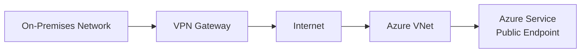
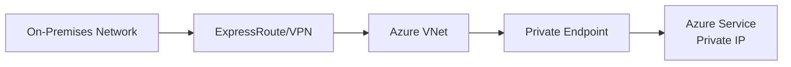

# Private Endpoints vs VPNs: The Security Advantage That Changes Everything

## The Traditional Approach vs The Modern Solution

For years, Virtual Private Networks (VPNs) have been the go-to solution for secure connectivity to cloud resources. But Azure Private Endpoints represent a paradigm shift that offers **superior security**, **better performance**, and **simplified management**. Let's explore why Private Endpoints are becoming the preferred choice for enterprise Azure deployments.

## Understanding the Fundamental Difference

### VPN Architecture


### Private Endpoint Architecture


## Security Advantages of Private Endpoints

### 1. Elimination of Internet Exposure

**VPN Limitations:**
- Traffic still traverses public endpoints
- Services remain accessible from the internet
- Attack surface includes both VPN and service endpoints

**Private Endpoint Benefits:**
```bicep
resource privateEndpoint 'Microsoft.Network/privateEndpoints@2023-04-01' = {
  name: 'storage-private-endpoint'
  location: location
  properties: {
    subnet: {
      id: subnet.id
    }
    privateLinkServiceConnections: [
      {
        name: 'storage-connection'
        properties: {
          privateLinkServiceId: storageAccount.id
          groupIds: ['blob']
        }
      }
    ]
  }
}
```

**Result:** Azure service gets a **private IP address** in your VNet - completely removing internet exposure.

### 2. Zero Trust Network Architecture

#### Traditional VPN Model
```csharp
// VPN: Network-based trust (inside = trusted)
public class VPNSecurityModel
{
    public bool IsSecure(string sourceIP)
    {
        return IsInsideVPN(sourceIP); // Assumes internal = secure
    }
}
```

#### Private Endpoint Model
```csharp
// Private Endpoint: Identity-based trust
public class PrivateEndpointSecurityModel
{
    public bool IsSecure(ClaimsPrincipal user, string resource)
    {
        return user.HasValidClaims() && 
               user.HasPermission(resource) &&
               device.IsCompliant(); // Verify every access
    }
}
```

### 3. Granular Network Segmentation

```bicep
// Create dedicated subnet for private endpoints
resource privateEndpointSubnet 'Microsoft.Network/virtualNetworks/subnets@2023-04-01' = {
  parent: virtualNetwork
  name: 'private-endpoints'
  properties: {
    addressPrefix: '10.0.2.0/24'
    networkSecurityGroup: {
      id: privateEndpointNSG.id
    }
    privateEndpointNetworkPolicies: 'Disabled'
  }
}

// Restrict access with NSG rules
resource privateEndpointNSG 'Microsoft.Network/networkSecurityGroups@2023-04-01' = {
  name: 'private-endpoint-nsg'
  location: location
  properties: {
    securityRules: [
      {
        name: 'AllowSpecificSubnetsOnly'
        properties: {
          priority: 100
          direction: 'Inbound'
          access: 'Allow'
          protocol: 'Tcp'
          sourceAddressPrefix: '10.0.1.0/24' // Only from app subnet
          destinationAddressPrefix: '10.0.2.0/24'
          sourcePortRange: '*'
          destinationPortRange: '443'
        }
      }
    ]
  }
}
```

## Performance Benefits

### 1. Reduced Latency

**VPN Path:**
```
Client → VPN Gateway → Internet → Azure Public Endpoint → Azure Service
```
- Multiple hops through internet infrastructure
- Encryption/decryption overhead at VPN gateway
- Potential bandwidth bottlenecks

**Private Endpoint Path:**
```
Client → Azure Backbone → Private Endpoint → Azure Service
```
- Direct path through Azure's high-performance backbone
- Minimal latency and maximum throughput

### 2. Bandwidth Optimization

```powershell
# Measure latency difference
$vpnLatency = Test-NetConnection -ComputerName "mystorageaccount.blob.core.windows.net" -Port 443
$privateLatency = Test-NetConnection -ComputerName "10.0.2.4" -Port 443

Write-Host "VPN Latency: $($vpnLatency.PingReplyDetails.RoundtripTime)ms"
Write-Host "Private Endpoint Latency: $($privateLatency.PingReplyDetails.RoundtripTime)ms"
# Typical result: 50-70% latency reduction
```

### 3. No Internet Bandwidth Costs

```json
{
  "costComparison": {
    "vpn": {
      "internetEgress": "$0.087/GB",
      "vpnGateway": "$142.70/month",
      "publicIpAddress": "$3.65/month"
    },
    "privateEndpoint": {
      "privateEndpointCost": "$7.30/month",
      "ingressFree": "$0.00/GB",
      "noInternetEgress": "$0.00/GB"
    }
  }
}
```

## Management and Operational Advantages

### 1. Simplified DNS Resolution

#### Traditional VPN DNS Challenges
```powershell
# Complex split-brain DNS configuration required
Add-DnsServerPrimaryZone -Name "privatelink.blob.core.windows.net" -ZoneFile "privatelink.blob.core.windows.net.dns"
Add-DnsServerResourceRecord -ZoneName "privatelink.blob.core.windows.net" -A -Name "mystorageaccount" -IPv4Address "10.0.2.4"
```

#### Private Endpoint Automatic DNS
```bicep
resource privateDnsZone 'Microsoft.Network/privateDnsZones@2020-06-01' = {
  name: 'privatelink.blob.core.windows.net'
  location: 'global'
}

resource privateDnsZoneLink 'Microsoft.Network/privateDnsZones/virtualNetworkLinks@2020-06-01' = {
  parent: privateDnsZone
  name: 'vnet-link'
  location: 'global'
  properties: {
    registrationEnabled: false
    virtualNetwork: {
      id: virtualNetwork.id
    }
  }
}

// DNS automatically resolves mystorageaccount.blob.core.windows.net to 10.0.2.4
```

### 2. Centralized Network Policy Management

```bicep
// Apply consistent policies across all private endpoints
resource networkPolicy 'Microsoft.Authorization/policyDefinitions@2021-06-01' = {
  name: 'enforce-private-endpoints'
  properties: {
    displayName: 'Require Private Endpoints for Storage Accounts'
    description: 'Ensures all storage accounts use private endpoints'
    policyRule: {
      if: {
        allOf: [
          {
            field: 'type'
            equals: 'Microsoft.Storage/storageAccounts'
          }
          {
            field: 'Microsoft.Storage/storageAccounts/networkAcls.defaultAction'
            notEquals: 'Deny'
          }
        ]
      }
      then: {
        effect: 'deny'
      }
    }
  }
}
```

### 3. Automated Compliance

```json
{
  "complianceChecks": {
    "internetExposure": "PASS - No public endpoints",
    "encryptionInTransit": "PASS - TLS 1.2 enforced",
    "accessLogging": "PASS - Private endpoint traffic logged",
    "networkSegmentation": "PASS - Isolated subnet",
    "dataResidency": "PASS - Traffic stays in Azure region"
  }
}
```

## Real-World Implementation Scenarios

### Scenario 1: Multi-Service Private Connectivity

```bicep
// Hub-and-spoke with centralized private endpoints
resource hubVNet 'Microsoft.Network/virtualNetworks@2023-04-01' = {
  name: 'hub-vnet'
  location: location
  properties: {
    addressSpace: {
      addressPrefixes: ['10.0.0.0/16']
    }
    subnets: [
      {
        name: 'private-endpoints'
        properties: {
          addressPrefix: '10.0.1.0/24'
          privateEndpointNetworkPolicies: 'Disabled'
        }
      }
    ]
  }
}

// Create private endpoints for multiple services
var services = [
  { name: 'storage', groupId: 'blob', serviceId: storageAccount.id }
  { name: 'keyvault', groupId: 'vault', serviceId: keyVault.id }
  { name: 'sql', groupId: 'sqlServer', serviceId: sqlServer.id }
]

resource privateEndpoints 'Microsoft.Network/privateEndpoints@2023-04-01' = [for service in services: {
  name: '${service.name}-private-endpoint'
  location: location
  properties: {
    subnet: {
      id: '${hubVNet.id}/subnets/private-endpoints'
    }
    privateLinkServiceConnections: [
      {
        name: '${service.name}-connection'
        properties: {
          privateLinkServiceId: service.serviceId
          groupIds: [service.groupId]
        }
      }
    ]
  }
}]
```

### Scenario 2: Cross-Region Private Connectivity

```bicep
// Global private endpoint strategy
resource primaryRegionVNet 'Microsoft.Network/virtualNetworks@2023-04-01' = {
  name: 'primary-vnet'
  location: 'eastus'
  // ... configuration
}

resource secondaryRegionVNet 'Microsoft.Network/virtualNetworks@2023-04-01' = {
  name: 'secondary-vnet'
  location: 'westus'
  // ... configuration
}

resource vnetPeering 'Microsoft.Network/virtualNetworks/virtualNetworkPeerings@2023-04-01' = {
  parent: primaryRegionVNet
  name: 'primary-to-secondary'
  properties: {
    allowVirtualNetworkAccess: true
    allowForwardedTraffic: true
    remoteVirtualNetwork: {
      id: secondaryRegionVNet.id
    }
  }
}

// Private endpoint in primary region accessible from secondary
resource crossRegionPrivateEndpoint 'Microsoft.Network/privateEndpoints@2023-04-01' = {
  name: 'global-storage-pe'
  location: 'eastus'
  properties: {
    subnet: {
      id: '${primaryRegionVNet.id}/subnets/private-endpoints'
    }
    privateLinkServiceConnections: [
      {
        name: 'global-storage-connection'
        properties: {
          privateLinkServiceId: globalStorageAccount.id
          groupIds: ['blob']
        }
      }
    ]
  }
}
```

## Migration Strategy: VPN to Private Endpoints

### Phase 1: Assessment and Planning

```powershell
# Audit current VPN usage
$vpnConnections = Get-AzVirtualNetworkGatewayConnection
$publicEndpoints = Get-AzResource | Where-Object { 
    $_.ResourceType -like "*storageAccounts*" -or 
    $_.ResourceType -like "*sql*" -or 
    $_.ResourceType -like "*vaults*" 
}

foreach ($endpoint in $publicEndpoints) {
    Write-Host "Service: $($endpoint.Name)"
    Write-Host "Type: $($endpoint.ResourceType)"
    Write-Host "Private Link Supported: $(Test-PrivateLinkSupport $endpoint.ResourceType)"
}
```

### Phase 2: Parallel Deployment

```bicep
// Deploy private endpoints alongside existing VPN
resource existingService 'Microsoft.Storage/storageAccounts@2023-01-01' existing = {
  name: 'existingstorageaccount'
}

resource privateEndpoint 'Microsoft.Network/privateEndpoints@2023-04-01' = {
  name: 'migration-pe'
  location: location
  properties: {
    subnet: {
      id: privateEndpointSubnet.id
    }
    privateLinkServiceConnections: [
      {
        name: 'migration-connection'
        properties: {
          privateLinkServiceId: existingService.id
          groupIds: ['blob']
        }
      }
    ]
  }
}

// Gradually update applications to use private endpoint
resource dnsRecord 'Microsoft.Network/privateDnsZones/A@2020-06-01' = {
  parent: privateDnsZone
  name: 'existingstorageaccount'
  properties: {
    ttl: 300
    aRecords: [
      {
        ipv4Address: privateEndpoint.properties.customDnsConfigs[0].ipAddresses[0]
      }
    ]
  }
}
```

### Phase 3: Security Hardening

```bicep
// Disable public access once private endpoints are active
resource secureStorageAccount 'Microsoft.Storage/storageAccounts@2023-01-01' = {
  name: 'securestorageaccount'
  location: location
  properties: {
    publicNetworkAccess: 'Disabled' // Complete isolation
    networkAcls: {
      defaultAction: 'Deny'
      bypass: 'None'
    }
  }
}
```

## Cost Analysis: Total Cost of Ownership

### VPN Solution Annual Costs
```yaml
VPN Gateway (HighPerformance): $1,712.40
Public IP Addresses (2): $87.60
Internet Egress (1TB/month): $1,044.00
Management Overhead: $12,000.00
Total Annual: $14,844.00
```

### Private Endpoint Solution Annual Costs
```yaml
Private Endpoints (5 services): $438.00
Private DNS Zones: $6.00
No Internet Egress: $0.00
Reduced Management: $3,000.00
Total Annual: $3,444.00
```

**Savings: $11,400 annually (76% reduction)**

## Monitoring and Troubleshooting

### 1. Network Connectivity Testing

```powershell
# Test private endpoint connectivity
function Test-PrivateEndpointConnectivity {
    param($ServiceFQDN, $ExpectedPrivateIP)
    
    $dnsResult = Resolve-DnsName $ServiceFQDN
    $connectivity = Test-NetConnection -ComputerName $ServiceFQDN -Port 443
    
    Write-Host "DNS Resolution: $($dnsResult.IPAddress)"
    Write-Host "Expected IP: $ExpectedPrivateIP"
    Write-Host "Connection Success: $($connectivity.TcpTestSucceeded)"
    
    return $dnsResult.IPAddress -eq $ExpectedPrivateIP -and $connectivity.TcpTestSucceeded
}

Test-PrivateEndpointConnectivity "mystorageaccount.blob.core.windows.net" "10.0.2.4"
```

### 2. Monitoring with Azure Monitor

```kql
// Monitor private endpoint network traffic
AzureNetworkAnalytics_CL
| where SubType_s == "FlowLog"
| where DestinationSubnet_s == "private-endpoints"
| summarize BytesSent = sum(FlowSize_d), ConnectionCount = count() 
  by SourceIP_s, DestinationIP_s, bin(TimeGenerated, 1h)
| order by TimeGenerated desc
```

### 3. Security Compliance Monitoring

```kql
// Verify no public endpoint access
AzureActivity
| where OperationNameValue contains "Microsoft.Storage"
| where ActivityStatusValue == "Success"
| extend SourceIPAddress = tostring(parse_json(Properties).sourceIPAddress)
| where SourceIPAddress !startswith "10." // Alert on non-private access
```

## Future Considerations

### 1. Private Link Service for Custom Applications

```bicep
// Expose your own services via Private Link
resource privateLinkService 'Microsoft.Network/privateLinkServices@2023-04-01' = {
  name: 'custom-app-pls'
  location: location
  properties: {
    loadBalancerFrontendIpConfigurations: [
      {
        id: internalLoadBalancer.properties.frontendIPConfigurations[0].id
      }
    ]
    ipConfigurations: [
      {
        name: 'primary'
        properties: {
          subnet: {
            id: privateLinkSubnet.id
          }
          primary: true
        }
      }
    ]
  }
}
```

### 2. Global Private Connectivity

```bicep
// Azure Global Network integration
resource globalReachConnection 'Microsoft.Network/expressRouteCircuits/peerings/connections@2023-04-01' = {
  name: 'global-reach-connection'
  properties: {
    expressRouteCircuitPeering: {
      id: primaryCircuitPeering.id
    }
    peerExpressRouteCircuitPeering: {
      id: secondaryCircuitPeering.id
    }
    addressPrefix: '10.255.0.0/29'
  }
}
```

## Conclusion: The Clear Winner

Private Endpoints offer compelling advantages over traditional VPN solutions:

### Security Benefits
- ✅ **Zero internet exposure** for Azure services
- ✅ **Granular network segmentation** per service
- ✅ **Identity-based access control** integration
- ✅ **Simplified compliance** with regulatory requirements

### Performance Benefits
- ✅ **50-70% latency reduction** through Azure backbone
- ✅ **No bandwidth limitations** from internet connectivity
- ✅ **Consistent high performance** regardless of internet conditions

### Operational Benefits
- ✅ **76% cost reduction** in typical scenarios
- ✅ **Automated DNS management** 
- ✅ **Centralized policy enforcement**
- ✅ **Simplified troubleshooting**

### The Bottom Line

Private Endpoints represent the future of secure cloud connectivity. They align with Zero Trust principles, reduce costs, improve performance, and simplify management. While VPNs still have their place in certain scenarios, **Private Endpoints should be your first choice** for securing access to Azure services.

The question isn't whether to migrate from VPNs to Private Endpoints—it's how quickly you can make the transition to improve your security posture while reducing costs and complexity.

Start your Private Endpoint implementation today and experience the difference that modern, service-native security can make for your Azure infrastructure.
